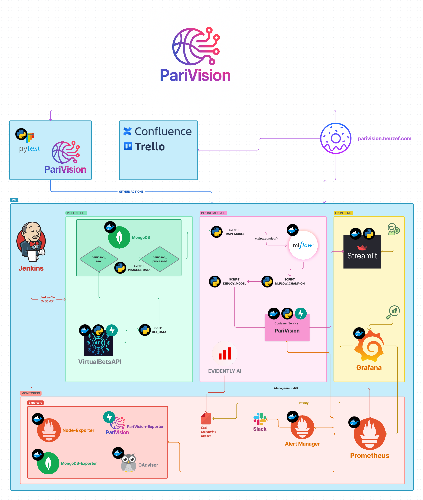

        
        
        
 

# PariVision

> https://parivision.heuzef.com

Projet d'étude MLOPS de 2025, prediction des paris sportif autour du NBA. C’est un problème parfait pour traiter l’ensemble des étapes d’un projet de Data Science.

## Navigation
 

Sommaire

- [PariVision](#parivision)
  - [🏞 Workflow](#-workflow)
  - [🛠 Stack Tech](#-stack-tech)
  - [⚙ Usage](#-%EF%B8%8Fusage)
  - [👨🏻‍ About the Author](#-about-the-authors)
  - [📖 License](#-license)

## 🏞 Workflow

 

## 🛠 Stack Tech
- [![Python][Python-badge]][Python-url] - A general-purpose programming language

[Python-badge]: https://img.shields.io/badge/Python-3776AB?style=for-the-badge&logo=python
[Python-url]: }
- [![Shell][Shell-badge]][Shell-url] - A command-line interface scripting language used on Unix/Linux systems

[Shell-badge]: https://img.shields.io/badge/Shell-89E051?style=for-the-badge&logo=shell
[Shell-url]: }
- [![Docker][Docker-badge]][Docker-url] - An open-source platform for deploying applications

[Docker-badge]: https://img.shields.io/badge/Docker-2496ED?style=for-the-badge&logo=docker
[Docker-url]: }
- [![Kubernetes][Kubernetes-badge]][Kubernetes-url] - A container management system

[Kubernetes-badge]: https://img.shields.io/badge/Kubernetes-326CE5?style=for-the-badge&logo=kubernetes
[Kubernetes-url]: }
- [![Git][Git-badge]][Git-url] - A version control system

[Git-badge]: https://img.shields.io/badge/Git-F05032?style=for-the-badge&logo=git
[Git-url]: }
- [![GitHub][GitHub-badge]][GitHub-url] - An online Git repository hosting service

[GitHub-badge]: https://img.shields.io/badge/GitHub-181717?style=for-the-badge&logo=github
[GitHub-url]: }
- [![MongoDB][MongoDB-badge]][MongoDB-url] - NoSQL document database

[MongoDB-badge]: https://img.shields.io/badge/MongoDB-47A248?style=for-the-badge&logo=mongodb
[MongoDB-url]: }
- [![Jenkins][Jenkins-badge]][Jenkins-url] - Open-source CI/CD server

[Jenkins-badge]: https://img.shields.io/badge/Jenkins-D24939?style=for-the-badge&logo=jenkins
[Jenkins-url]: }
- [![GitHub Actions][GitHub Actions-badge]][GitHub Actions-url] - CI/CD workflows on GitHub

[GitHub Actions-badge]: https://img.shields.io/badge/GitHub%20Actions-2088FF?style=for-the-badge&logo=github-actions
[GitHub Actions-url]: }
- [![Vault][Vault-badge]][Vault-url] - Secrets management tool

[Vault-badge]: https://img.shields.io/badge/Vault-000000?style=for-the-badge&logo=vault
[Vault-url]: }
- [![Prometheus][Prometheus-badge]][Prometheus-url] - Monitoring and alerting system

[Prometheus-badge]: https://img.shields.io/badge/Prometheus-E6522C?style=for-the-badge&logo=prometheus
[Prometheus-url]: }
- [![Grafana][Grafana-badge]][Grafana-url] - Data visualization tool

[Grafana-badge]: https://img.shields.io/badge/Grafana-F46800?style=for-the-badge&logo=grafana
[Grafana-url]: }
- [![Slack][Slack-badge]][Slack-url] - Team communication platform

[Slack-badge]: https://img.shields.io/badge/Slack-611F69?style=for-the-badge&logo=slack
[Slack-url]: }
- [![Zoom][Zoom-badge]][Zoom-url] - Video conferencing platform

[Zoom-badge]: https://img.shields.io/badge/Zoom-2D8CFF?style=for-the-badge&logo=zoom
[Zoom-url]: }
- [![Trello][Trello-badge]][Trello-url] - Project management tool with boards

[Trello-badge]: https://img.shields.io/badge/Trello-0079BF?style=for-the-badge&logo=trello
[Trello-url]: }
- [![Confluence][Confluence-badge]][Confluence-url] - Team knowledge sharing platform

[Confluence-badge]: https://img.shields.io/badge/Confluence-172B4D?style=for-the-badge&logo=confluence
[Confluence-url]: }

## ⚙ ️Usage

Toute la documentation est disponible dans le [rapport du projet](https://github.com/DataScientest-Studio/DEC24_MLOPS_PARIS_SPORTIFS/tree/master/reports/)

## 👨🏻‍ About the Authors

> Heuzef, Pierre Cohen, Jianying Shi

This project was created by Heuzef, Pierre Cohen, Jianying Shi. Connect with us on [my website](https://heuzef.com) and [LinkedIn](https://www.linkedin.com/in/heuzef/) to learn more about our projects and professional backgrounds.

## 📖 License

This work is licensed under CC BY-NC-SA 4.0 2025

Autor : Heuzef (heuzef.com) - contact@heuzef.com

<a href="#readme-top">Top ⬆️</a>
